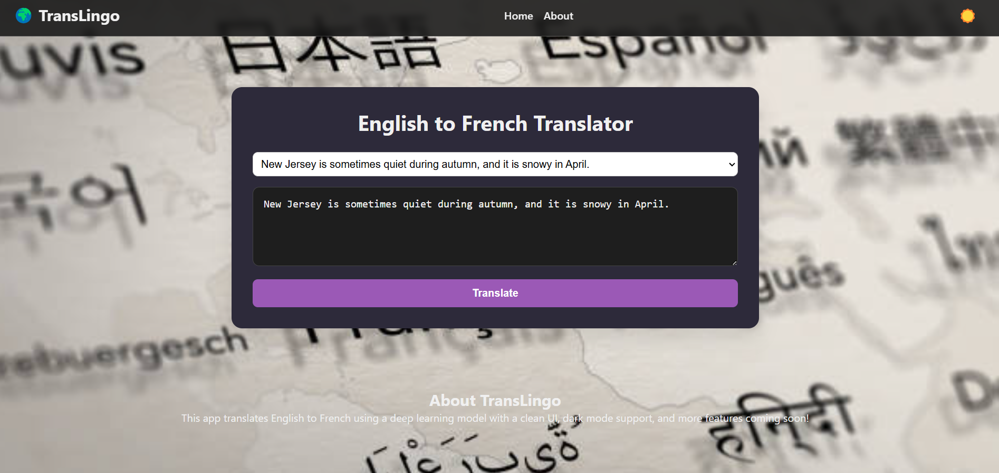

# 🌐 TransLingo – Frontend

A sleek, responsive language translation web app built with **React** and **Tailwind CSS**. TransLingo allows users to input text and get real-time translations in French or Spanish using intelligent NLP models running on a Flask backend. Featuring a modern UI and smooth animations for an engaging user experience.

🔗 [Live Demo](https://dashing-starship-f27d7a.netlify.app/)

> ## 📸 Frontend Preview



---

## 🚀 Features

- 📝 Translate English text to French and Spanish
- 🔄 Realtime response from Flask NLP models
- 🌐 Toggle between multiple language options
- 🖼️ Clean, modern UI with hover effects
- 🌙 Dark mode support
- ⚙️ REST API integrated frontend
- 📱 Mobile-friendly and fully responsive

---

## 🛠️ Tech Stack

- **React.js** – Frontend framework
- **Tailwind CSS** – Utility-first styling
- **Framer Motion** – Animations and transitions
- **Axios** – API calls to Flask backend
- **React Icons** – Icons and UI elements

---

## ⚙️ Getting Started

### 1. Clone the repo

```bash
git clone https://github.com/Vaishnaviii03/Translingo-frontend.git
cd flickpick-frontend
```
### 2. Install dependencies


```bash
npm install
```
### 3. Run the app

```bash
npm start
```

🔗 [Backend Repo](https://github.com/Vaishnaviii03/Translingo-backend)

This frontend connects to a Flask backend for movie data and recommendations.
